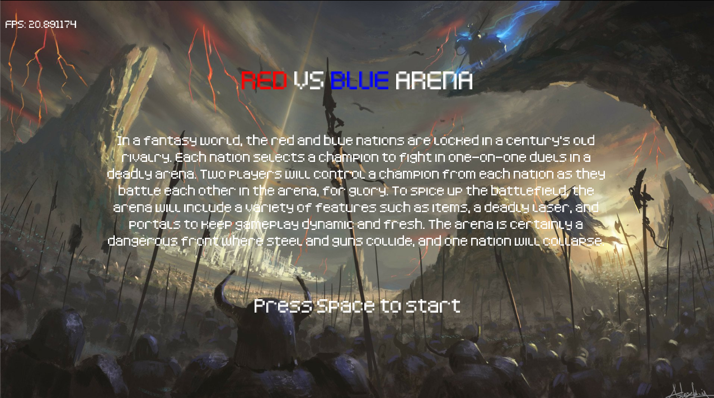
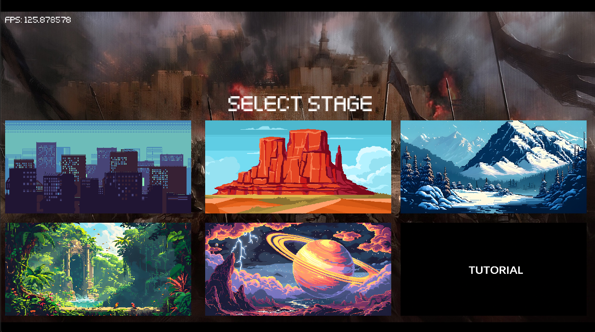
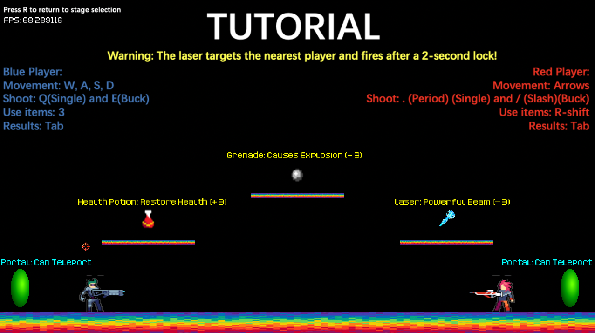
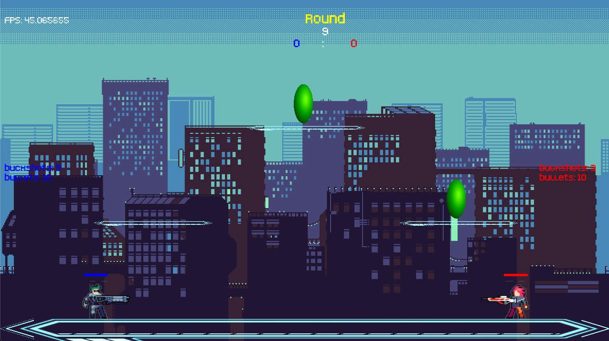
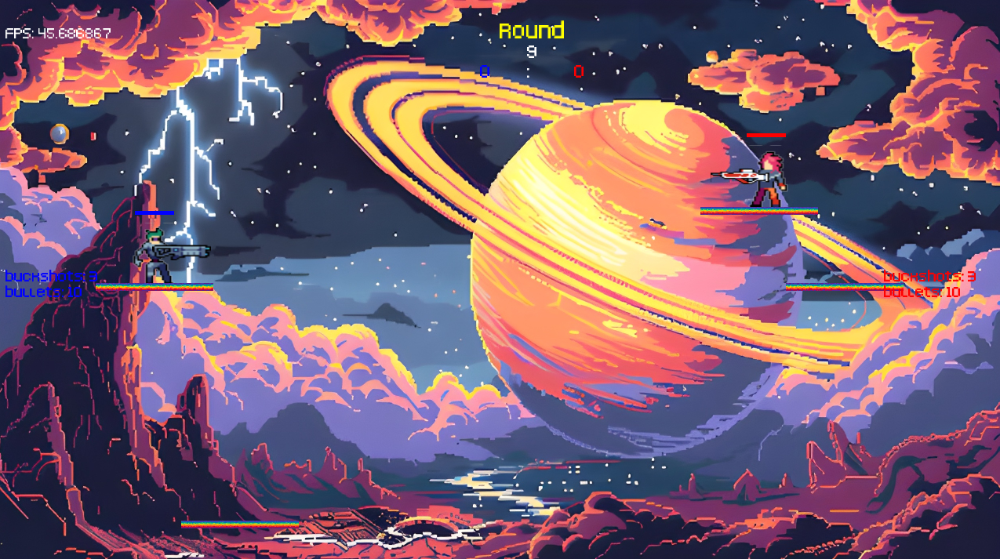
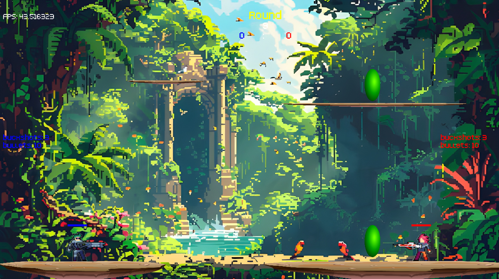

# Red vs Blue Arena

## Overview
Red vs Blue Arena is a real-time 2D game framework developed using C++, OpenGL, and GLSL. The project emphasizes high-performance rendering, dynamic visual effects, and interactive gameplay mechanics. Built with CMake for cross-platform compatibility, the game offers a seamless experience on Linux and other systems.

## Explore Game Highlights

  
  
  

  
  
  

## Key Features
- **Advanced Rendering Techniques:** Utilizes OpenGL for optimized rendering, ensuring smooth gameplay with high frame rates.
- **Dynamic Movements:** Implements transformation matrices for fluid and responsive character and object animations.
- **Shader Effects:** Leverages GLSL shaders for vertex and fragment processing, enabling stunning visual effects.
- **Physics-Based Mechanics:** Integrates geometry manipulation and collision detection for realistic interactions and enhanced gameplay.
- **AI-Driven Elements:** Introduces AI-based behaviors to provide dynamic challenges and immersive experiences.
- **Cross-Platform Support:** Built with CMake, ensuring easy deployment across Linux and other operating systems.

## Technologies Used
- **Programming Languages:** C++
- **Rendering Libraries:** OpenGL
- **Shader Programming:** GLSL
- **Build System:** CMake
- **Operating Systems:** Linux (primary)

## Installation
### Prerequisites
- CMake (3.10 or higher)
- GCC or Clang compiler
- OpenGL and GLU development libraries

